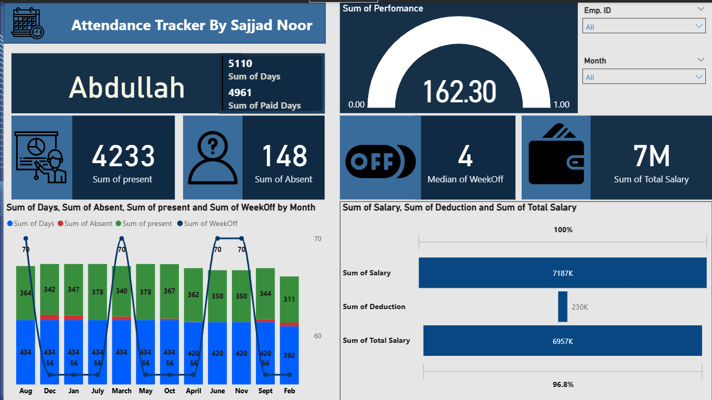

# 📊 Employee Attendance & Salary Tracker Dashboard

A fully automated *Power BI Dashboard* integrated with *Excel (Power Query)* for employee attendance and payroll management.  
This project simplifies HR tasks, ensuring accurate salary calculations and clear attendance insights at a glance.

---

## 🚀 Features
- ✅ *Dynamic Filters*
  - Employee Card (Name)
  - Employee ID Dropdown
  - Month Dropdown
- ✅ *Attendance KPIs*
  - Paid Days, Total Days, Present, Absent, Weekend Days
- ✅ *Payroll Analysis*
  - Total Salary, Salary Deduction, Net Paid Salary
- ✅ *Visualizations*
  - Gauge Chart → Attendance %
  - Combo Chart → Attendance vs Salary
  - Salary Breakdown → Gross Salary vs Deductions vs Net Paid
- ✅ *Automation*
  - Power Query for Data Cleaning & Auto Refresh

---

## 📂 Project StructureEmployee-Attendance-Salary-Dashboard/
│ ├── Data/
│   ├── Attendance.xlsx         # Attendance data sample
│   ├── Summary.xlsx            # Salary summary data sample
│ ├── Dashboard/
│   ├── EmployeeDashboard.pbix  # Power BI file (editable)
│ ├── Images/
│   ├── Dashboard.png  # Dashboard Screenshot
│   ├── salary_breakdown.png    # Salary Breakdown Screenshot
│   ├── project_banner.png      # Project Banner
│ └── README.md
---

## 📸 Dashboard Preview
### Main Dashboard

### Salary Breakdown

### Project Banner

---

## 🛠 Tech Stack
- *Microsoft Excel (Power Query)* – Data Processing & Automation  
- *Power BI* – Data Visualization & Dashboard  

---

## 🎯 Use Case
This project is designed for *HR & Payroll teams* to:  
- Automate attendance tracking  
- Calculate salaries with deductions  
- Provide real-time, interactive insights  

---

## 📧 Contact
👤 *Sajjad noor ud din *  
📩 Email: hiresajjadnoor786@gmail.com  
🔗 LinkedIn: [https://www.linkedin.com/in/sajjad-noor/]  

---
✨ If you like this project, don’t forget to *star ⭐ the repository*!
